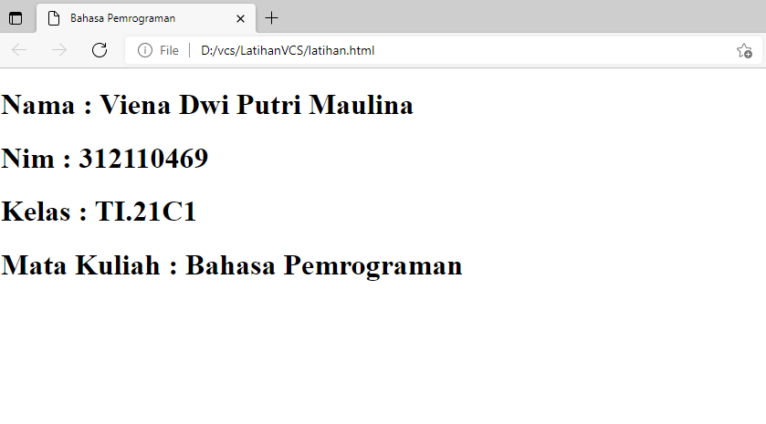

# TUTORIAL PENGGUNAAN GIT
## BAHASA PEMROGRAMAN
### Viena Dwi Putri Maulina 312110469

1. Buka web Github kemudian masuk ke akun
2. Cara membuat Repository
    klik New
    
    kemudian isi repository name > publik > ceklis add a README file
    
    maka tampilannya seperti ini
    
3. Cara membuat html
    copy link
    
    buat folder di local disk d  (vcs).
	Buka aplikasi Gitbash yang sudah diinstall.
	untuk masuk  ke user ketik sebagai berikut.
	$ pwd
	$ cd /d/vcs/  (tempat folder yang tadi dibuat)
	$ git clone (link yang tadi dicopy, maka akan muncul repository yang tadi dibuat diGithub)
    
	kemudian buka file readme.
	buat file baru dengan klik file > new file > kemudian save.
    
	ketik html :5, maka akan muncul seperti ini
    
	kemudian tambahkan sesuai keinginan contohnya seperti berikut.
    
	kemudian save.
	lalu buka file html tadi
    
    dan muncul seperti berikut.
    
3. cara membuat perubahan file html lokal menuju server repository
	buka gitbush
	masuk ke cd repository dengan mengetik :
	$ cd LatihanVCS/
	$ git add latihan.html (nama file html)
	$ git status
	$ git config --global user.email "vienamaulina@gmail.com"
	$ git config --global user.name "Viena Maulina"
	$ git commit -m "menambahkan file html"
	$ git push -u origin main
    
	buka github, dan akan muncul tampilan seperti itu
    
4. Cara Memasukan gambar ke server repository
	screenshot gambar/pindahkan gambar yang ingin dimunculkan ke repository
	buka file README.md yang tadi.
	ubah sesuai keinginan, misal seperti berikut.
    
	buka aplikasi gitbush untuk melakukan perubahan lokal le server repository
	ketik :
    $ git add ss/contoh.png
    $ git add README.md
    $ git commit -m "menambahkan gambar"
    $ git push -u origin main
    
    maka tampilannya akan seprti berikut
    
    -seleseai-
    semoga bermanfaat

